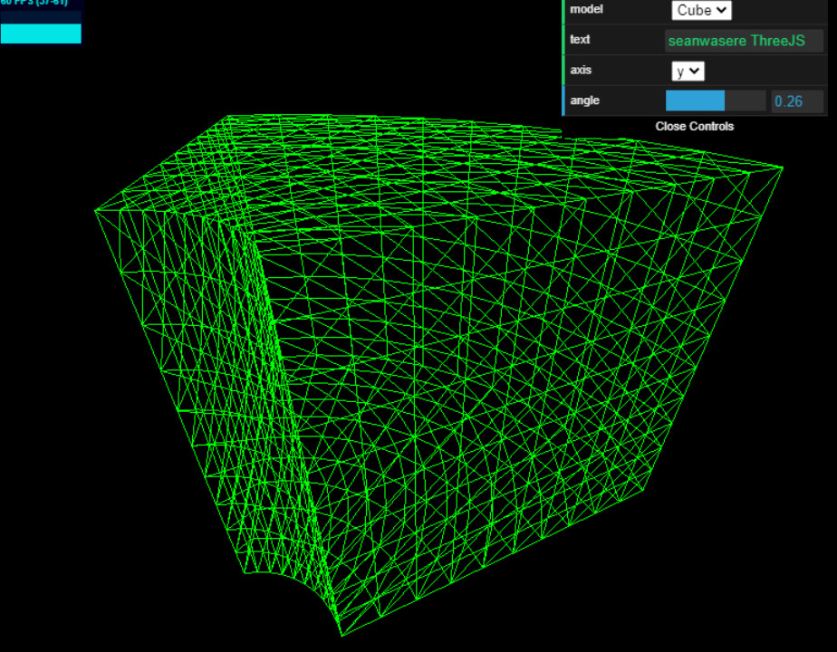
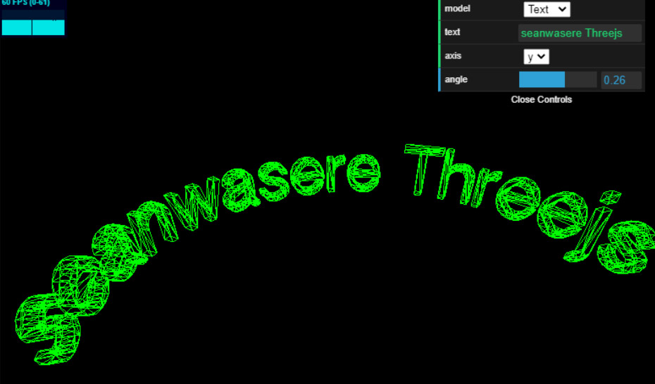

# Bender
Bend Geometries in Threejs. Works with geometries of base type THREE.Geometry and THREE.BufferGeometry.

## Usage
```typescript
bend(geometry: THREE.Geometry | THREE.BufferGeometry, axis: string, angle: number)
```





```bash
git clone https://github.com/Sean-Bradley/Bender.git
cd Bender
npm install
npm run dev
```

This is a typescript project consisting of two sub projects with there own tsconfigs.

To edit this example, then modify the files in `./src/client/` or `./src/server/`. The projects will auto recompile if you started by using `npm run dev`

or

You can simply just import the generated `./dist/client/bender.js` directly into your project as a module.

```html
<script type="module" src="./bender.js"></script>
```

or as ES6 import

```typescript
import Bender from './bender.js'
```
## See Working Example

https://codesandbox.io/s/github/Sean-Bradley/Bender/tree/master/

## Threejs TypeScript Course

Visit https://github.com/Sean-Bradley/Three.js-TypeScript-Boilerplate for a Threejs TypeScript boilerplate containing many extra branches that demonstrate many examples of Threejs.

> To help support this Threejs example, please take a moment to look at my official Threejs TypeScript course at 

[](https://www.udemy.com/course/threejs-tutorials/?referralCode=4C7E1DE91C3E42F69D0F)

  [Three.js and TypeScript](https://www.udemy.com/course/threejs-tutorials/?referralCode=4C7E1DE91C3E42F69D0F)<br/>  
  Discount Coupons for all my courses can be found at [https://sbcode.net/coupons](https://sbcode.net/coupons)
